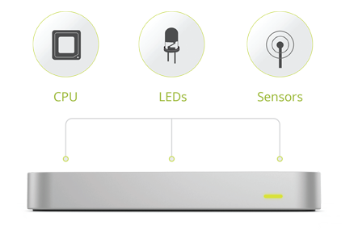
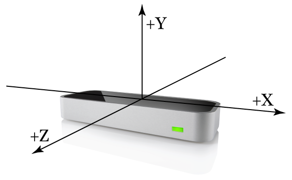
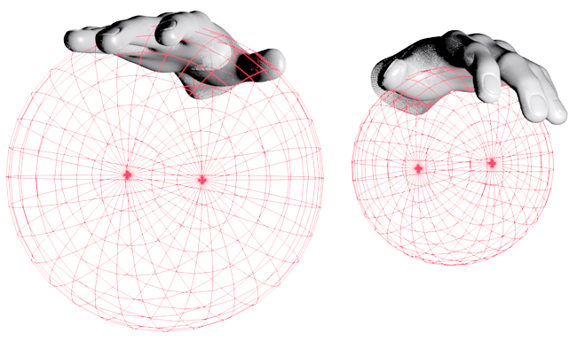
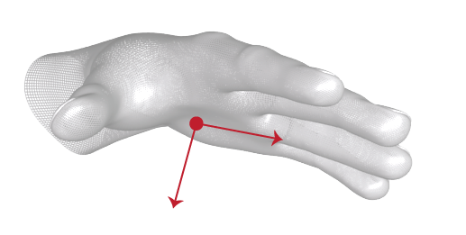

# Leap

The [Leap](http://leapmotion.com) device is a small motion sensor for capturing hand gestures.  The following provides links to various Leap-related projects and resources.

## Projects

* [leap](https://github.com/joyrexus/leap) is our repo for experimenting with
  various ways to render gesture samples captured with the leap device.

* [handy](https://github.com/joyrexus/handy) provides a simple CLI for 
  recording and viewing a gesture sample.

* [sandbox](https://github.com/joyrexus/sandbox/tree/master/leap) contains a
  few simple demos.

These projects were largely inspired by [@syntagmatic](https://github.com/syntagmatic)'s [leap-play](https://github.com/syntagmatic/leap-play) and [prehensile](https://github.com/syntagmatic/prehensile).

## WebSocket Stream

This [gist](https://gist.github.com/joyrexus/5555728) demonstrates how to
connect to the device's [websocket stream](https://gist.github.com/joyrexus/7217032).  It pipes a user specified number of frames from the Leap's websocket stream to `stdout` or to a user specified filename.

## Resources

* [Developer Portal](https://developer.leapmotion.com/dashboard)

* [API](https://developer.leapmotion.com/documentation/api/annotated)

* [Leap JS](http://js.leapmotion.com/)

  * [Overview](https://developer.leapmotion.com/documentation/Languages/JavaScript/Guides/Leap_Overview.html)
  * [Tutorial](https://developer.leapmotion.com/documentation/guide/Sample_JavaScript_Tutorial)
  * [Demos](http://leapmotion.github.io/leapjs/examples/)
  * [Gists](https://gist.github.com/leapjs)
  * [API](https://developer.leapmotion.com/documentation/Languages/JavaScript/API/index.html)

* [WebSocket Overview](https://gist.github.com/joyrexus/7217032)

* [Open Leap Forum](https://github.com/openleap)

* [Usage Tips and Tutorials](http://support.leapmotion.com/forums/22301371-Tutorials)

## Overview

The Leap Motion device provides a 3D-gestural interaction space of approximately 8 cubic feet.  Within this field of view it detects hand motion and orientation as well as finger locations relative to the hand. 

Detailed specs are not readily available, but we've been able to gather the following from media coverage and developer forum discussions.

The device is digitally sampling a continuous/analog signal (hand/finger movements within the device's detection space), which it's sampling with multiple sensors.  It uses 2 [CCD](https://en.wikipedia.org/wiki/Charge-coupled_device) cameras and 3 [infrared](http://en.wikipedia.org/wiki/Infrared) [LED](https://en.wikipedia.org/wiki/Light-emitting_diode)s.  

The various sensors on the device are repeatedly capturing depth/positional info at a given rate (~ 215 times per second).  These raw signals serve as the inputs to the skeletal model and motion-sensing algorithms used to infer hand/finger position, orientation, etc., in a probablistic manner.  

Little is known about how the various sensor signals are integrated.
Some onboard processing is involved, but most of the computational work is
happening on the CPU to which the device is connected. (The Leap SDK and device
drivers are OS-specific.) 

The Leap SDK's underlying motion sensing techniques are supposedly unique. It does not capture color information or full-stop "point cloud" data (which would involve unnecessary computational overhead).  Presumably a proprietary skeletal model is being used to efficiently infer the motion/positional data available in the data stream.

The data stream is available through various APIs.  It consists of "frame" data, where a frame consists of hand position/orientation/velocity, etc.  Think of a frame as a quantitive snapshot of gestural action at a given instant.  Frames are streamed at a maximum of 290 frames per second in "fast" mode.

Developers can use one of the various APIs to selectively acccess and do something with this data stream.  It's also possible to use the raw data stream available through
the device's websocket, where each frame emitted is a chunk of JSON.

The precision of the Leap's motion-sensing scales up or down according to the hardware it's connected to and only uses one to two percent of a CPU's capabilities to work. 

The device is powered via its USB connection.  It supports both the USB 2.0 and
3.0 standards, though the manufacturere appears to be targeting the existing market where USB 2.0 ports are dominant. A wireless device is rumored to be under development as well.

There are rumors that multiple sensors can be used to increase the virtual workspace in which hand motions are detected.

## Specs

CPU usage: ~ 2%

FPS: ~ 290?

Accuracy: 0.01 mm (1/100 of a millimeter)

Interaction space:

The device can detect motion within a roughly coned-shaped projected upward.

* Volume: 8 cubic feet
* Min height: 1 cm
* Max height: 2-3 feet (depending on detection mode)

For more info and speculation, see [the unofficial Leap FAQ](https://forums.leapmotion.com/showthread.php?420-The-unofficial-Leap-FAQ).

## Images

Detection/interaction space or "field of view".

### Device

### Fingers

### Hand

### Palm

### Gesture

### Tool

