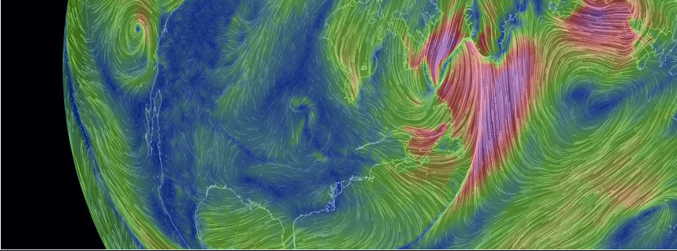

# Forecast design for thermal anomolies

Let's investigate the "Thermal Anomaly" referred to in the DFW essay "Derivative Sport in Tornado Alley".  Let's think about this in relation to short-term, mesoscale wind forecasting, and the perceptual/aesthetic dimensions of rendering such a forecast.

---

> **The biggest single factor in Central Illinois' quality of outdoor life is wind.** There are more local jokes than I can summon about bent weather vanes and leaning barns, more downstate sobriquets for kinds of wind than there are in Malamut for snow. The wind had a personality, a (poor) temper, and, apparently, agendas. The wind blew autumn leaves into intercalated lines and arcs of force so regular you could photograph them for a textbook on Cramer's Rule and the cross-products of curves in 3-space. It molded winter snow into blinding truncheons that buried stalled cars and required citizens to shovel out not only driveways but the sides of homes; a Central Illinois "blizzard" starts only when the snowfall stops and the wind begins. Most people in Philo didn't comb their hair because why bother. Ladies wore those plastic flags tied down over their parlor-jobs so regularly I thought they were required for a real classy coiffure; girls on the East Coast outside with their hair hanging and tossing around looked wanton and nude to me. Wind wind etc. etc.
>
> The people I know from outside it distill the Midwest into blank flatness, black land and fields of green fronds or five-o'clock stubble, gentle swells and declivities that make the topology a sadistic exercise in plotting quadrics, highway vistas so same and dead they drive motorists mad. Those from IN/WI/Northern IL think of their own Midwest as agronomics and commodity futures and corn-detasseling and bean-walking and seed-company caps, apple-checked Nordic types, cider and slaughter and football games with white fogbanks of breath exiting helmets. But in the odd central pocket that is Champaign-Urbana, Rantoul, Philo, Mahomet-Seymour, Mattoon, Farmer City, and Tolono, Midwestern life is informed and deformed by wind. **Weatherwise, our township is on the eastern upcurrent of what I once heard an atmospherist in brown tweed call a Thermal Anomaly. Something about southward rotations of crisp air off the Great Lakes and muggy southern stuff from Arkansas and Kentucky miscegenating, plus an odd dose of weird zephyrs from the Mississippi valley three hours west.** 
>
> Chicago calls itself the Windy City, but Chicago, one big windbreak, does not know from a true religious-type wind. And **meteorologists have nothing to tell people in Philo, who know perfectly well that the real story is that to the west, between us and the Rockies, there is basically nothing tall, and that weird zephyrs and stirs joined breezes and gusts and thermals and downdrafts and whatever out over Nebraska and Kansas and moved east like streams into rivers and jets and military fronts that gathered like avalanches and roared in reverse down pioneer oxtrails, toward our own personal unsheltered asses.** The worst was spring, boys' high school tennis season, when the nets would stand out stiff as proud flags and an errant ball would blow clear to the easternmost fence, interrupting play on the next several courts. During a bad blow some of us would get rope out and tell Rob Lord, who was our fifth man in singles and spectrally thin, that we were going to have to tie him down to keep him from becoming a projectile. Autumn, usually about half as bad as spring, was a low constant roar and the massive clicking sound of continents of dry leaves being arranged into force-curves--I'd heard no sound remotely like this megaclicking until I heard, at nineteen, on New Brunswick's Fundy Bay, my first high-tide wave break and get sucked back out over a shore of polished pebbles. Summers were manic and gusty, then often around August deadly calm. The wind would just die some August days, and it was no relief at all; the cessation drove us nuts. Each August, we realized afresh how much the sound of wind had become part of the soundtrack to life in Philo. The sound of wind had become, for me, silence. When it went away, I was left with the squeak of the blood in my head and the aural glitter of all those little eardrum hairs quivering like a drunk in withdrawal. It was months after I moved to western MA before I could really sleep in the pussified whisper of New England's wind-sound.

---

* [earth](earth.nullschool.net) -- gorgeous wind visualization driven by [GFS](http://en.wikipedia.org/wiki/Global_Forecast_System) data and D3.

---

* [weather front](http://en.wikipedia.org/wiki/Weather_front)
* [bergen school](http://en.wikipedia.org/wiki/Bergen_School_of_Meteorology)
* [norwegian cyclone model](http://en.wikipedia.org/wiki/Norwegian_cyclone_model)
* [continuum mechanics](http://en.wikipedia.org/wiki/Continuum_mechanics)

---

* [GFS](http://en.wikipedia.org/wiki/Global_Forecast_System) - a global
  numerical weather prediction system containing a global computer model and
  variational analysis run by the US National Weather Service (NWS). 
* [WRF](http://en.wikipedia.org/wiki/Weather_Research_and_Forecasting_Model) -
  weather research and forecasting model; serves a wide range of
  meteorological applications across scales ranging from meters to thousands of
  kilometers.

---

* [Matthew Rocklin](http://matthewrocklin.com/)
  * *Uncertainty Quantification and Sensitivity Analysis in Dynamical Systems*
    * [thesis](rocklin/masters.pdf)
    * [slides](rocklin/slides.pdf)

